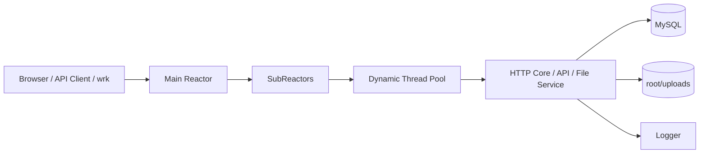

# Atlas WebServer


Atlas WebServer 是一个基于 C++、Linux `epoll` 和 MySQL 的工程化 Web 服务。项目提供完整的 HTTP 服务栈、鉴权能力、文件管理能力、操作审计、容器化部署、脚本化验证和基准测试材料，适合作为轻量业务服务或服务端基础能力演进样板。

## Overview

- 并发模型：`Main Reactor + Multi-SubReactor + Dynamic Thread Pool`
- 协议能力：HTTP/1.1、Keep-Alive、静态资源、JSON API、可选 HTTPS
- 业务能力：用户注册、登录、会话鉴权、文件上传下载、公开分享、操作日志
- 工程能力：配置文件与环境变量覆盖、Docker Compose 部署、健康检查、Smoke Test、Benchmark

## Capability Scope

### 已实现

- 静态资源服务和基础路由分发
- Bearer Token 鉴权与会话持久化
- 小文件上传、列表、下载、删除、公开可见范围切换
- 操作日志记录与查询
- 基于 MySQL 的用户、会话、文件元数据持久化
- Docker 化构建与运行
- 面向接口链路的脚本化冒烟测试

### 当前边界

- 以单体服务形态交付，未引入服务拆分
- 目标场景偏向中小规模文件与业务接口，不面向超大文件传输
- 当前未内置 Prometheus 指标、分布式追踪、CI/CD 流水线和 RBAC

## Architecture

架构说明见 [docs/architecture.md](/Users/mac/Desktop/TinyWebServer-master/docs/architecture.md)。



核心模块：

- `http/core`：连接生命周期、解析、路由、I/O、响应构造、运行时编排
- `http/api`：认证、会话恢复、私有接口和操作日志能力
- `http/files`：文件元数据、文件落盘、下载与可见性控制
- `threadpool`：动态线程池
- `timer`：连接超时治理
- `CGImysql`：MySQL 连接池与 RAII 封装
- `log`：同步/异步日志

## Repository Layout

```text
.
|-- main.cpp
|-- webserver.cpp
|-- server.conf
|-- http/
|   |-- core/
|   |-- api/
|   `-- files/
|-- root/
|   |-- *.html
|   `-- uploads/
|-- docker/
|   `-- mysql/init.sql
|-- scripts/
|   |-- run_smoke_suite.sh
|   |-- test_auth.sh
|   |-- test_private_api.sh
|   `-- test_files.sh
`-- docs/
```

## Quick Start

### Option A: Docker Compose

适合本地联调和快速验证。

```bash
docker compose up -d --build
curl -i http://127.0.0.1:9006/healthz
```

默认入口：

- Web: `http://127.0.0.1:9006`
- MySQL: `127.0.0.1:3307`

停止服务：

```bash
docker compose down
```

### Option B: Local Build

环境要求：

- Linux 或兼容的容器环境
- `g++` / `make`
- `libmysqlclient`
- `OpenSSL`
- 可访问的 MySQL 8 实例

编译：

```bash
make server
```

运行前建议通过环境变量注入敏感配置：

```bash
export TWS_DB_HOST=127.0.0.1
export TWS_DB_PORT=3306
export TWS_DB_USER=root
export TWS_DB_PASSWORD=root
export TWS_DB_NAME=qgydb
./server
```

## Configuration

默认配置文件为 [server.conf](/Users/mac/Desktop/TinyWebServer-master/server.conf)，环境变量优先级高于配置文件。

常用配置项：

| Key | Default | Description |
| --- | --- | --- |
| `port` / `TWS_PORT` | `9006` | 服务监听端口 |
| `log_write` / `TWS_LOG_WRITE` | `1` | 日志模式，`0` 为同步，`1` 为异步 |
| `thread_num` / `TWS_THREAD_NUM` | `8` | 工作线程数 |
| `sql_num` / `TWS_SQL_NUM` | `8` | MySQL 连接池大小 |
| `conn_timeout` / `TWS_CONN_TIMEOUT` | `15` | 空闲连接超时秒数 |
| `https_enable` | `0` | 是否启用 HTTPS |
| `https_cert_file` | `./certs/server.crt` | 证书路径 |
| `https_key_file` | `./certs/server.key` | 私钥路径 |
| `db_host` / `TWS_DB_HOST` | `127.0.0.1` | 数据库主机 |
| `db_port` / `TWS_DB_PORT` | `3306` | 数据库端口 |
| `db_user` / `TWS_DB_USER` | `root` | 数据库用户名 |
| `db_password` / `TWS_DB_PASSWORD` | empty | 数据库密码 |
| `db_name` / `TWS_DB_NAME` | `qgydb` | 数据库名 |

生产场景建议：

- 不在 `server.conf` 中保存数据库密码或鉴权密钥
- 通过环境变量或密钥管理系统注入敏感值
- 为 `root/uploads` 配置持久化存储

## Runtime Endpoints

### Public

- `GET /healthz`
- `GET /`
- `POST /api/register`
- `POST /api/login`

### Private

需要 `Authorization: Bearer <token>`：

- `GET /api/private/ping`
- `POST /api/private/logout`
- `GET /api/private/operations`
- `DELETE /api/private/operations/:id`
- `GET /api/private/files`
- `POST /api/private/files`
- `GET /api/private/files/:id/download`
- `POST /api/private/files/:id/visibility`
- `DELETE /api/private/files/:id`

### Public File APIs

- `GET /api/files/public`
- `GET /api/files/public/:id`
- `GET /api/files/public/:id/download`

### Static Pages

- `/index.html`
- `/login.html`
- `/register.html`
- `/files.html`
- `/log.html`

## Verification

### Smoke Test

服务启动后执行：

```bash
./scripts/run_smoke_suite.sh
```

覆盖内容：

- 注册与登录
- 私有接口鉴权
- 文件上传、列表、下载、删除

### Manual Check

```bash
curl -i http://127.0.0.1:9006/healthz
curl -i http://127.0.0.1:9006/
```

## Performance

基准测试说明见 [docs/benchmark.md](/Users/mac/Desktop/TinyWebServer-master/docs/benchmark.md)。

当前文档中的代表性结果：

- `GET /healthz`：最高约 `7.5k req/s`
- `GET /api/private/ping`：最高约 `7.4k req/s`
- `GET /api/private/files`：约 `2.1k ~ 3.1k req/s`
- `POST /api/login` 和 `POST /api/private/files` 仍是主要写路径瓶颈

这些数字来自特定硬件和部署参数，仅用于趋势判断与优化参考，不应直接视为生产 SLA。

## Operations Notes

- `docker compose` 默认挂载 `./root/uploads`，便于文件持久化
- `mysql-data` 通过 Docker volume 持久化数据库数据
- 当前仓库提供健康检查与基础日志能力，但监控、告警和灰度发布仍需在上层平台补齐
- 若启用 HTTPS，需要提前准备证书并配置 `https_cert_file` 与 `https_key_file`

## Documentation

- [Architecture](/Users/mac/Desktop/TinyWebServer-master/docs/architecture.md)
- [API Reference](/Users/mac/Desktop/TinyWebServer-master/docs/api.md)
- [Request Sequence](/Users/mac/Desktop/TinyWebServer-master/docs/request-sequence.md)
- [File Module](/Users/mac/Desktop/TinyWebServer-master/docs/file-module.md)
- [Benchmark Report](/Users/mac/Desktop/TinyWebServer-master/docs/benchmark.md)
- [Release Notes](/Users/mac/Desktop/TinyWebServer-master/RELEASE_NOTES.md)

## Roadmap

- 增加标准化指标暴露与监控接入
- 引入更细粒度的权限模型
- 优化文件列表与登录链路的数据库访问成本
- 为上传链路补充更稳健的限流、配额和错误恢复机制
- 补齐 CI、制品发布和回归验证流水线

## License

[MIT License](/Users/mac/Desktop/TinyWebServer-master/LICENSE)
