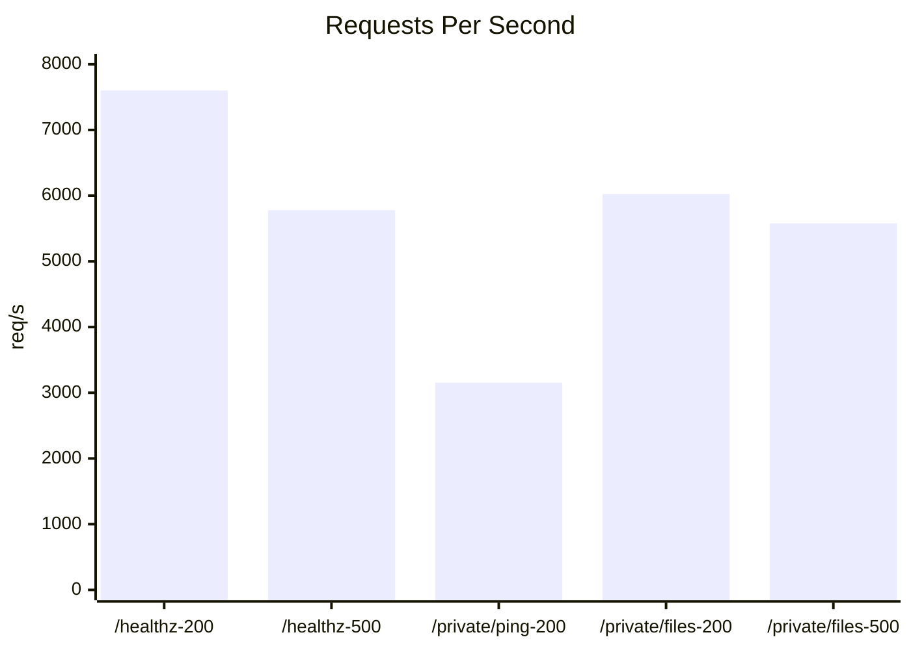
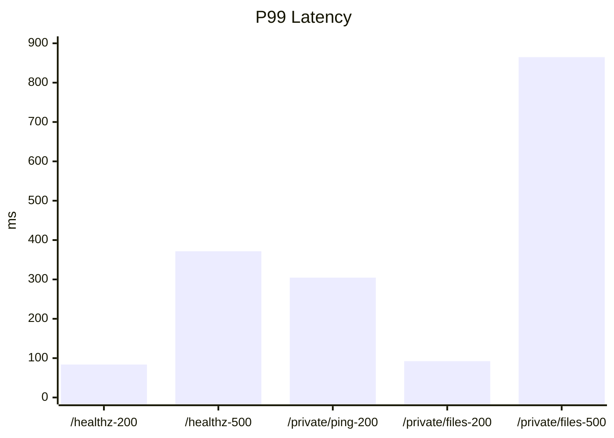
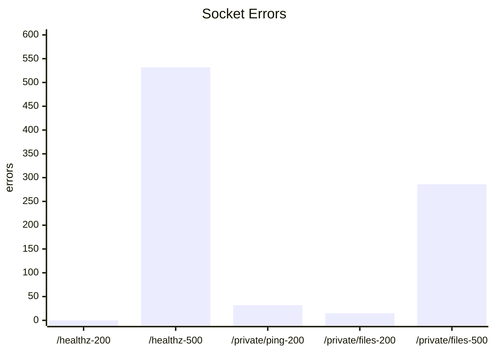

# Benchmark 模板

这份文档用于沉淀秋招项目里的压测材料。建议每次压测都记录环境、命令和结果，不要只写一个 QPS 数字。

## 测试环境

- 机器: MacBook Pro
- CPU: 未采集，当前沙箱禁止读取 `sysctl` 硬件详情
- 内存: 未采集，当前沙箱禁止读取 `sysctl` 硬件详情
- OS: macOS Sonoma 14.6, Darwin 23.6.0, x86_64
- Docker / 裸机: `web` 与 `mysql` 均运行在 Docker Compose 容器中
- 服务版本: 当前工作区未提交版本，包含文件模块、密码哈希、持久化 session、64 KB 小文件上传演示
- MySQL 是否本机: 是，通过同机 Docker 容器访问

## 压测对象

- 健康检查: `GET /healthz`
- 鉴权接口: `GET /api/private/ping`
- 文件列表: `GET /api/private/files`

## 命令

```bash
cd test_pressure

./wrk_test.sh http://127.0.0.1:9006/healthz 200 10s 4 ./healthz.lua
./wrk_test.sh http://127.0.0.1:9006/healthz 500 10s 4 ./healthz.lua

TOKEN=replace-with-real-token \
./wrk_test.sh http://127.0.0.1:9006/api/private/ping 200 10s 4 ./private_ping.lua

TOKEN=replace-with-real-token \
./wrk_test.sh http://127.0.0.1:9006/api/private/files 200 10s 4 ./private_files.lua
```

## 结果记录

| 接口 | 并发 | 时长 | QPS | Avg Latency | P95/P99 | Max | Errors |
| --- | --- | --- | --- | --- | --- | --- | --- |
| `/healthz` | 200 | 10s | 7601.75 | 29.09ms | P95 未采集 / P99 83.77ms | 1.09s | 无 |
| `/healthz` | 500 | 10s | 5779.42 | 91.75ms | P95 未采集 / P99 371.61ms | 1.21s | read 527, timeout 5 |
| `/api/private/ping` | 200 | 10s | 3153.38 | 68.74ms | P95 未采集 / P99 304.58ms | 1.19s | read 32 |
| `/api/private/files` | 200 | 10s | 6024.66 | 36.31ms | P95 未采集 / P99 92.37ms | 1.11s | timeout 15 |
| `/api/private/files` | 500 | 10s | 5579.91 | 102.38ms | P95 未采集 / P99 864.80ms | 1.80s | read 241, timeout 45 |

原始数据也已经整理成 CSV，见 [benchmark.csv](benchmark.csv)。
静态图文件见 [benchmark-qps.svg](benchmark-qps.svg)、[benchmark-p99.svg](benchmark-p99.svg) 和 [benchmark-errors.svg](benchmark-errors.svg)。

## 图表

QPS 对比：



P99 延迟对比：



错误数对比：



## 结论模板

- 带 `--latency` 的正式压测显示，`/healthz` 在 200 并发下约 7.6k QPS，P99 约 83.77ms；升到 500 并发后，QPS 降到约 5.8k，P99 升到约 371.61ms，说明在更高并发下排队和连接层抖动已经明显增加。
- `GET /api/private/ping` 在 200 并发下约 3.15k QPS，P99 约 304.58ms，明显低于 `/healthz`，说明鉴权路径和会话查询已经带来了可观开销，这组数据更适合拿来说明“真实业务接口”与“基础探活接口”的性能差异。
- `GET /api/private/files` 在 200 并发下约 6.0k QPS，P99 约 92.37ms，明显快于 `private/ping`，说明当前文件列表接口虽然走了鉴权和数据库查询，但在这份测试数据里仍比更轻的私有 ping 路径稳定，这通常意味着数据库命中规模较小、返回 JSON 拼装成本可控。
- `GET /api/private/files` 提升到 500 并发后，QPS 还能维持在约 5.6k，但 P99 直接升到约 864.80ms，且开始出现 `read/timeout` 错误，说明这个接口在更高并发下虽然吞吐没有明显崩掉，但尾延迟已经恶化得很明显。
- `wrk --latency` 原生输出只给到 `50/75/90/99` 分位，因此表里记录了 `P99`；如果还想补 `P95`，需要换支持更多分位数的工具链，或对原始延迟数据做二次统计。

## 图表建议

- 吞吐图: X 轴并发数，Y 轴 `Requests/sec`
- 延迟图: X 轴并发数，Y 轴 `Avg/P95 Latency`
- 错误率图: X 轴并发数，Y 轴错误数
